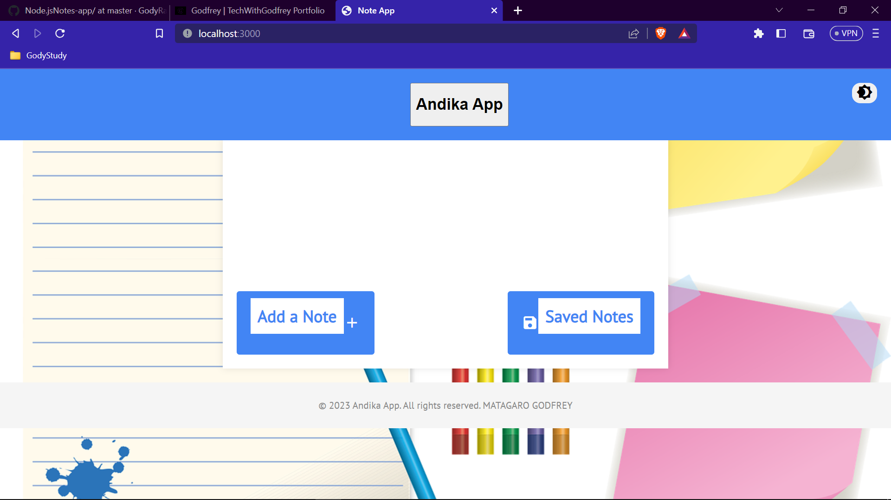
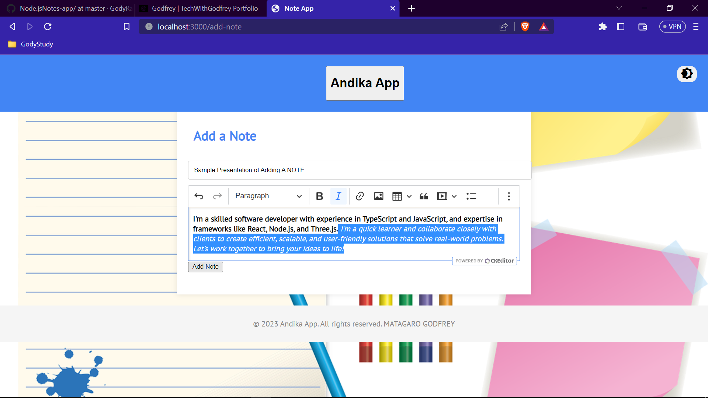
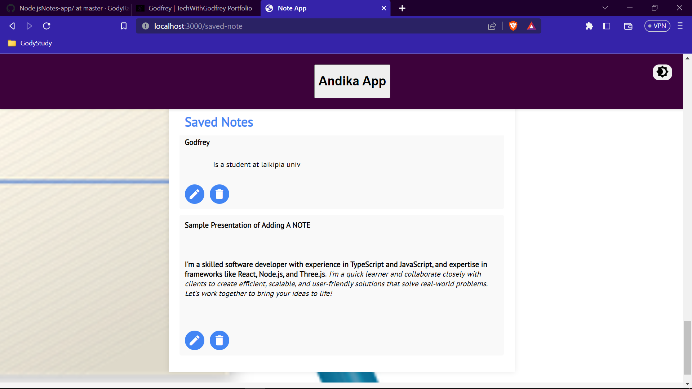
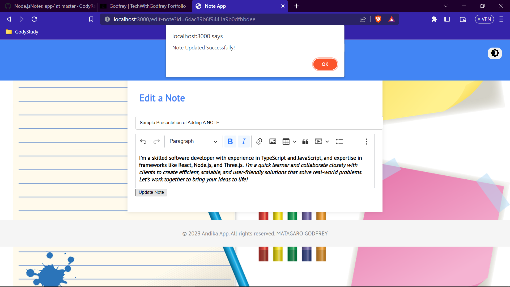
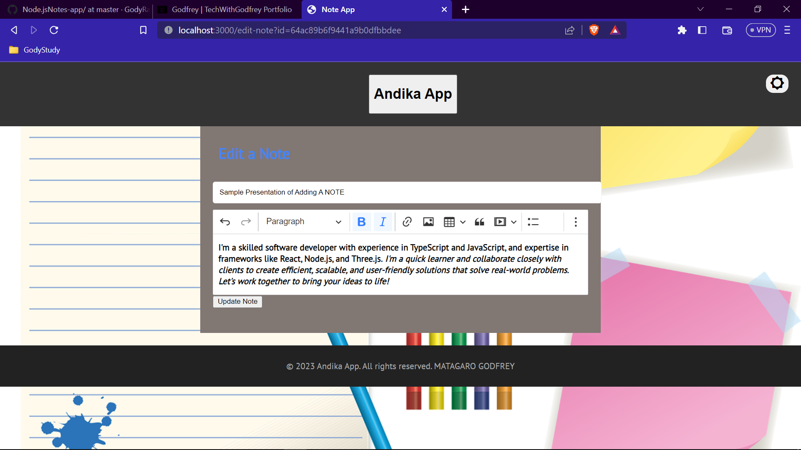

# Notes App

This is a simple CRUD (Create, Read, Update, Delete) application for taking notes. It was a project during 2nd Year internal Attachment on developing sample APIs (Laikipia University). It was built using Node.js, Express, and MongoDB. For templating, EJS was used.

## Features

- Create, read, update, and delete notes
- Rich text editor for notes
- API to be used on front end
- UI interactivity
- Dark Theme Toggle
  ## ScreenShots
  
*Home UI*
 
  *Add A Note*
 
  *Saved/Read A Note*

 
*Update/ Edit a Note*
 
*Dark Mode*

## Installation

1. Clone the repository
2. ```bash
   git clone https://github.com/GodyRacks/Node.jsNotes-app.git
3. Navigate to app directory
   ```bash
   cd app
4. Install dependencies
   ```bash
   npm install express mongoose axios nodemon body-parser morgan ejs dotenv
5. Create a mongodb atlas cluster, free preferably then obtain password to use on your Mongo_URI, see edited `./app/config.env` as an example.
6. Start the server using
   ```bash
   npm start
you can check out the package_json file and see how i used nodemon to automatically refresh the server any time changes are made.//console logs

## Usage

1. Open your web browser and navigate to `http://localhost:3000`. OR when you type `npm start` in the terminal (VSCode) you will see `http://localhost:3000`. click on it it will open your application on the browser.
2. Create, read, update, or delete notes as needed

## Improvements
- Predictive search for notes
- Notes encryption for added security
- Better responsive web design
-  Flash messages for user feedback
- Account registration and login
- Add more authentication options
- Code improvement overall
- Contributions are highly welcomed!

